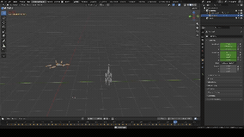

# 🪼 Jellyfish AI

> **Work in progress — v0.2.** Early experimental release; tested inside Blender on Windows, expect rough edges.

**Jellyfish AI** is a Blender addon that makes sea creatures move on their own. Drop a jellyfish, a turtle
and a fish into a scene, hit **Bake**, and each one perceives the others (and any object you tag as food or
danger), reacts — flee, chase, feed, freeze, huddle, protect a hurt companion — and gets its own animation
baked from that reaction. Nobody hand-keys the creature; the behavior is emergent, driven entirely by the
same engine behind the [Unique Host / CCM](https://doi.org/10.5281/zenodo.20648800) project, stripped down
to just its somatic (body-state) layer.

*Jellyfish, turtle and fish reacting to each other and to tagged objects in Blender.*

The point of this experiment is to show how the CCM engine can be used to control and move a body in 3D
space: the engine makes the decisions, and the creature's body simply follows them.

It is **not** physics and **not** a pre-made animation cycle: every tick (a fixed 0.2 real-world seconds,
independent of scene FPS) the engine reads what's nearby, runs it through the Cognitive Coherence Model's
chemical/vitality systems, and turns the winning internal state into a weighted blend of movement channels
(heading, speed, body wave, pulse, drift...). Two creatures never play the same animation twice unless the
scene around them is identical.

## ✨ Features

- **Decisions made by the CCM engine.** Every creature decides what to do using the Cognitive Coherence
  Model's engine (the same one behind Unique Host), not scripted rules or hand-made animation cycles.
- **Three species out of the box** — Jellyfish (bell + 6 tentacles), Turtle (body/neck/head + 4 fins),
  Fish (body/head/tail + 2 pectoral fins) — each with its own procedurally-generated rig, no mesh or
  armature required from the user.
  You can load as many of each as you like — several jellyfish, several turtles, a whole school of fish —
  and every one runs its own independent engine.
- **Real perception, not scripted triggers.** Every creature senses every other tagged object within its
  sense radius (by name keyword, relative size, or explicit custom properties) and reacts through the full
  CCM chemical system: danger → flee, food → approach and eat, an unknown presence → group up, a threatened
  ally → cooperate or protect, depending on its own health.
- **Multi-agent baking.** One button (**Bake All Creatures**) ticks every tagged rig in the scene in
  lockstep, frame by frame, over the range you set — so a jellyfish, a turtle and a fish can genuinely
  interact with each other, not just react to hand-animated props.
- **Persistent story JSON.** Every bake appends an event (frame range, objects seen, per-tick log, final
  engine state per creature) to a JSON file. Bake again and each creature's engine resumes exactly where it
  left off, so you can build up a multi-event story instead of one isolated clip.
- **User-controlled danger/food values.** Mark any object as predator or food from the panel; damage and
  food value are per-object sliders (`jelly_damage`, `jelly_food_value`), not hardcoded — no property means
  a scene-wide default is used instead.
- **Real consequences.** Eaten food is actually removed from the scene (not hidden); enough damage drains a
  creature's structural integrity and then its health, freezing it (surrender) at zero.

## 🚀 Quick start

1. Blender **Edit > Preferences > Add-ons > Install...**, pick the addon's `.zip`, enable **Jellyfish AI**.
2. Open the **3D Viewport sidebar (N) > Jellyfish AI** tab.
3. Under **New creature**, pick a species and click **Create Creature Rig** — repeat for as many creatures
   as you want in the scene.
4. Select any other object (a cube, a mesh you already have) and click **Mark Selected as Predator** or
   **Mark Selected as Food** to tag it explicitly (or just name it with a keyword like `shark`/`turtle` vs
   `fish`/`shrimp`/`plankton` — unnamed objects fall back to relative size). Animate that object by hand if
   you want it moving.
5. Adjust **Sense Radius**, **Contact Radius**, **Max Speed** and the **Story JSON** path if needed.
6. Set the scene's **Start/End** frame range and click **Bake All Creatures**. Play back the timeline — the
   creatures now move on their own, and the event is appended to the story JSON.
7. Change the frame range and bake again to add the next event to the same story; each creature's engine
   picks up from its last recorded state.

## 🔬 How it works

Each tick (0.2 s), every creature does the same short loop:

1. **Perceive** — find the nearest food, danger or unidentified object within its sense radius, plus the
   nearest creature of its own species. Closer means a stronger stimulus.
2. **Feed the CCM engine** — the stimulus goes into the engine, which updates the creature's internal state
   (its body state, chemistry and vital needs such as hunger and energy).
3. **Read the result** — the engine's state becomes a blend of movement channels (heading, speed, body wave,
   pulse, drift) that moves and animates the creature for that tick.

Nothing tells a creature "run away now" or "protect your friend". Those behaviors come out of the engine's
state and the situation around it, so they change when the scene changes. Below are a few situations I ran
through the engine on its own (outside Blender, several jellyfish plus a predator, food, etc.) to see what
happens.

### Examples

**A group with nothing around.** Several jellyfish near each other settle into a calm, cooperative state and
drift slowly together, like a school. Their hunger slowly wears down their health until something is eaten.

**A predator approaches.** A healthy jellyfish keeps its calm until the predator gets close, then switches to
fleeing and moves directly away from it. Contact hurts: each hit lowers its structural integrity, and its
health follows.

**An injured jellyfish next to a healthy one.** This is the interesting case. Once a jellyfish is badly hurt
and a predator is still nearby, it stops fleeing for itself and turns toward its neighbor instead, moving
between the ally and the threat. The injured one ends up defending the healthier one rather than saving
itself.

**A whole group under threat.** With several jellyfish, the first to get hurt takes the hits while the others
stay cooperative. As the others get worn down too, they also shift from fleeing to protecting each other, so
the group ends up moving toward each other instead of scattering.

**Health reaches zero.** The creature freezes completely (a surrender-like state) and stays that way.

These are observations from test runs, not scripted outcomes: change the distances, the damage or how much
food is around and the story changes with them.

## 💬 Feedback

Try it, break it, and tell me what you find 🙌: open a GitHub Issue with what you did and what you expected,
or email Akimsa3@proton.me.

## 📄 Citation

Jellyfish AI reuses the somatic engine of the **Cognitive Coherence Model (CCM)**, described in the
accompanying paper:

> Cognitive Coherence Model (CCM). Zenodo. [https://doi.org/10.5281/zenodo.20648800](https://doi.org/10.5281/zenodo.20648800)

If you use this project or the CCM architecture in your own work, please cite the paper above.

## 📜 License

[PolyForm Noncommercial 1.0.0](LICENSE). Commercial use requires a separate license: Akimsa3@proton.me
